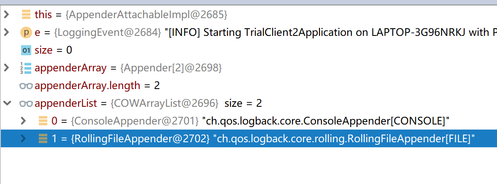
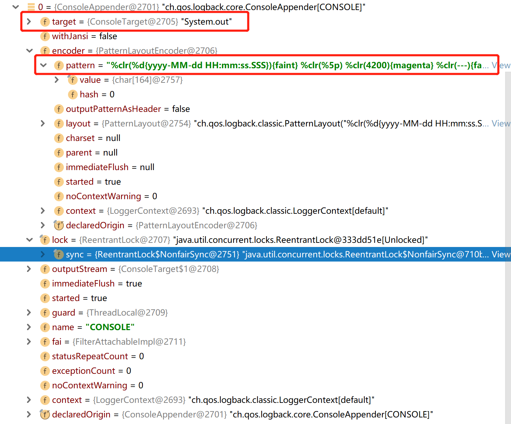
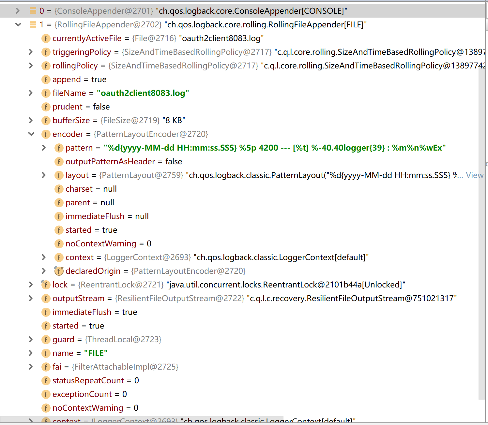
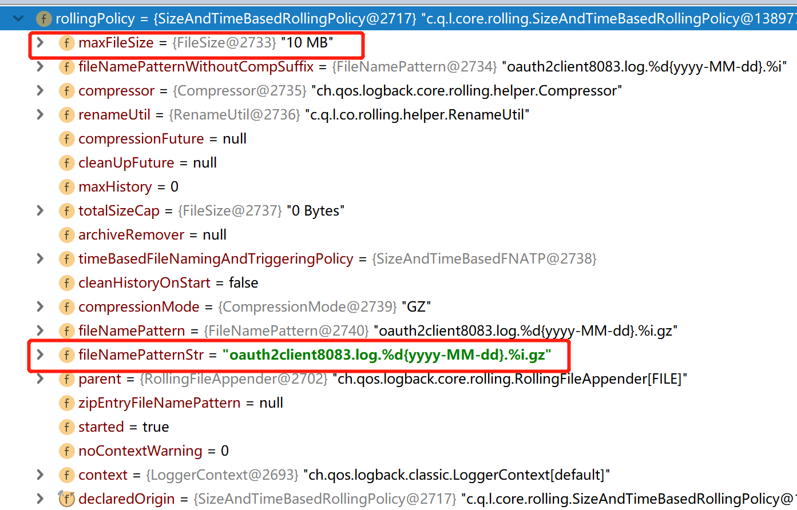

---

---

# LogBack 配置分析

## 默认配置

默认情况下LogBack配置了两个 appender

- ch.qos.logback.core.ConsoleAppender
- ch.qos.logback.core.rolling.RollingFileAppender



### 以下是ConsoleAppender的配置详情



**这里主要配置了两个地方， target这里使用的是System.out （标准输出）和encoder这个配置输出的格式**

### RollingFileAppender



这里也是两个比较重要的配置 rollingPolicy和encoder 其中rollingPolicy配置文件什么时候切换以及切换命名规则

encoder定义日志输出格式

以下是rollingPolicy的配置详情

_

这里的配置主要也是两个 maxFileSize 和 fileNamePattern 第一个指定文件最大为多少，第二个指定历史文件命名规则，其中 renameUtil则封装了对文件命名名的操作

## 配置异步日志

有了对以上内容的了解我们就可以自己编写一个logback.xml的配置文件了

```xml
<configuration>
    <appender name="stdout" class="ch.qos.logback.core.ConsoleAppender">
        <encoder>
            <pattern>%d hehe [%thread] %-5level %logger{36} [%file : %line] - %msg%n</pattern>
        </encoder>
    </appender>
    <appender name="file" class="ch.qos.logback.core.rolling.RollingFileAppender">
        <rollingPolicy class="ch.qos.logback.core.rolling.SizeAndTimeBasedRollingPolicy">
            <maxFileSize>20MB</maxFileSize>
            <maxHistory>0</maxHistory>
            <fileNamePattern>
                auth.log.%d{yyyy-MM-dd}.%i.gz
            </fileNamePattern>
        </rollingPolicy>
        <encoder>
            <pattern>{"logTime":"%d","thread":"[%thread]","level":"%level","logger":"%logger","file":"%file","line":%line,"msg":"%msg"}%n</pattern>
        </encoder>
    </appender>
    <root level="info">
        <appender-ref ref="stdout"/>
        <appender-ref ref="file"/>
    </root>
</configuration>
```

这样我们就得到一个和默认配置一样的配置文件，下面配置异步日志的话就是在这个配置文件中加入对就的异步Appender，并将它配置到root下面即可，加入后配置如下：

```xml
<configuration>
    <appender name="stdout" class="ch.qos.logback.core.ConsoleAppender">
        <encoder>
            <pattern>%d hehe [%thread] %-5level %logger{36} [%file : %line] - %msg%n</pattern>
        </encoder>
    </appender>
    <appender name="file" class="ch.qos.logback.core.rolling.RollingFileAppender">
        <rollingPolicy class="ch.qos.logback.core.rolling.SizeAndTimeBasedRollingPolicy">
            <maxFileSize>20MB</maxFileSize>
            <maxHistory>60</maxHistory>
            <fileNamePattern>
                auth.log.%d{yyyy-MM-dd}.%i.gz
            </fileNamePattern>
        </rollingPolicy>
        <encoder>
            <pattern>{"logTime":"%d","thread":"[%thread]","level":"%level","logger":"%logger","file":"%file","line":%line,"msg":"%msg"}%n</pattern>
        </encoder>
    </appender>
    <appender name="async" class="ch.qos.logback.classic.AsyncAppender">
        <discardingThreshold>0</discardingThreshold>
        <queueSize>1024</queueSize>
        <neverBlock>true</neverBlock>
        <includeCallerData>true</includeCallerData>        
        <appender-ref ref="file"/>
    </appender>
    <root level="info">
        <appender-ref ref="stdout"/>
        <appender-ref ref="async"/>
    </root>
</configuration>
```

这里需要说明的是异步日志的Appender并不真正提供写日志的实现，它需要依赖其它Appender才能将日志写出，并且官方提供的异步日志Appender中只能配置一个Appender，**框架是支持多个Appender的配置的不太清楚官方为什么限制只能使用一个Appender（笔者尝试重写了异步日志类去掉了该限制程序运行并无异常）**。

下面对这里的几个参数做一下说明 

- discardingThreshold 配置是否丢弃日志当配置大于等零的值时生效（当缓存队列连到一定阀值时将丢弃 trace和debug日志）（默认为队列大小的20%）
- queueSize 定义缓存队列的大小默认为（256）
- neverBlock 设置为true时写日志会用非阻塞方式（这里指向队列中加入日志消息时）
- includeCallerData 是否在主线程中加载代码信息，如果不设置该参数 日志中无法显示日志输出的文件和行号

异步Appender写日志的方法如下

```java
    @Override
    protected void append(E eventObject) {
        //首先判断队列空间是否过低 且 日志级别 在 INFO 以下 如果满足该条件则不写日志
        if (isQueueBelowDiscardingThreshold() && isDiscardable(eventObject)) {
            return;
        }
        preprocess(eventObject);
        put(eventObject);
    }
   @Override
   protected boolean isDiscardable(ILoggingEvent event) {
        Level level = event.getLevel();
       //判断日志级别是否低于INFO
        return level.toInt() <= Level.INFO_INT;
    }

    private boolean isQueueBelowDiscardingThreshold() {
        //剩余空间是否小于阀值
        return (blockingQueue.remainingCapacity() < discardingThreshold);
    }
    @Override
    public void start() {
        if (isStarted())
            return;
        if (appenderCount == 0) {
            addError("No attached appenders found.");
            return;
        }
        if (queueSize < 1) {
            addError("Invalid queue size [" + queueSize + "]");
            return;
        }
        blockingQueue = new ArrayBlockingQueue<E>(queueSize);
        //如果没有指定队列阀值 则取队列大小的 20%
        if (discardingThreshold == UNDEFINED)
            discardingThreshold = queueSize / 5;
        addInfo("Setting discardingThreshold to " + discardingThreshold);
        worker.setDaemon(true);
        worker.setName("AsyncAppender-Worker-" + getName());
        // make sure this instance is marked as "started" before staring the worker Thread
        super.start();
        //在启动的时候开启了一个新的线程来处理日志的写出
        worker.start();
    }
```

下面是我自己重写的不限制异步日志中不限制Appender个数的类

```java
public class MyAsyncAppender extends AsyncAppenderBase<ILoggingEvent> {
    boolean includeCallerData = false;
    //这里重写了 addAppender 方法去掉了加入appender个数的限制
    //需要注意的是新建的类要和AsyncAppenderBase 在同一个包下才可以访问aai成员变量
    @Override
    public void addAppender(Appender<ILoggingEvent> newAppender) {
//        if (appenderCount == 0) {
            appenderCount++;
            addInfo("Attaching appender named [" + newAppender.getName() + "] to AsyncAppender.");
            aai.addAppender(newAppender);
//        }else {
//            addWarn("One and only one appender may be attached to AsyncAppender.");
//            addWarn("Ignoring additional appender named [" + newAppender.getName() + "]");
//        }


    }
    /**
     * Events of level TRACE, DEBUG and INFO are deemed to be discardable.
     * @param event
     * @return true if the event is of level TRACE, DEBUG or INFO false otherwise.
     */
    @Override
    protected boolean isDiscardable(ILoggingEvent event) {
        Level level = event.getLevel();
        return level.toInt() <= Level.INFO_INT;
    }
    @Override
    protected void preprocess(ILoggingEvent eventObject) {
        eventObject.prepareForDeferredProcessing();
        if (includeCallerData){
            eventObject.getCallerData();
        }
    }

    public boolean isIncludeCallerData() {
        return includeCallerData;
    }

    public void setIncludeCallerData(boolean includeCallerData) {
        this.includeCallerData = includeCallerData;
    }
}
```

