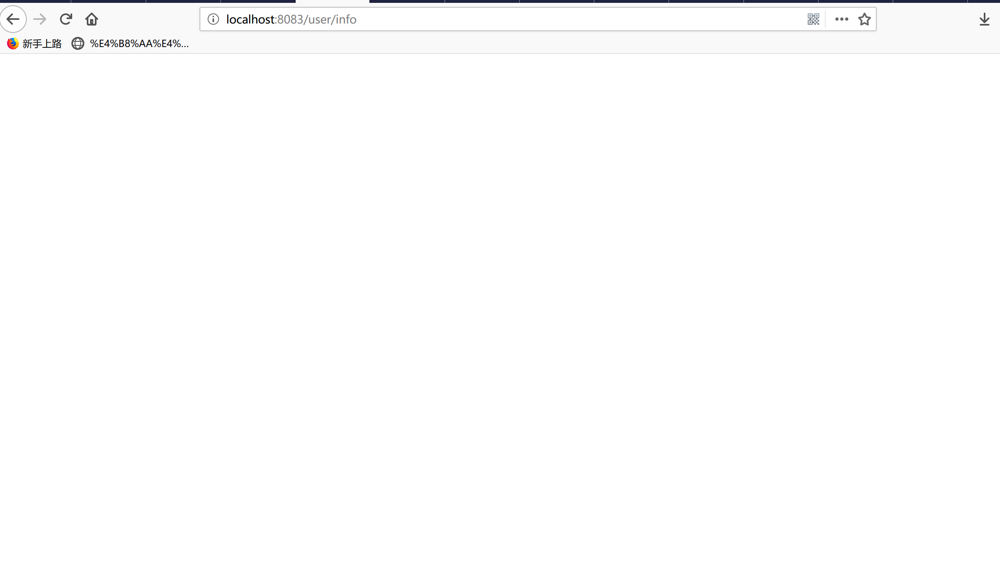
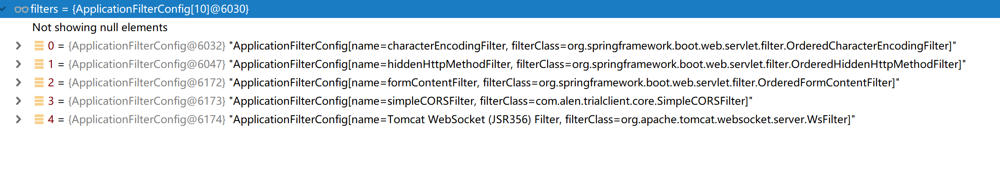

# SpringMVC 和Tomcat对接

## 一个自定义Filter引发的血案
在使用Oauth2Sso时无意中发现一个问题——所有的对接都已经完成但是所有页面都无法返回数据并且也不报错


这让老汉情何以堪，在各种地方设置断点最后发现DispatcherServlet只做了初始化并没有被调用doService方法

难道Tomcat有Bug没有把请求转发过来，于是进入了漫长的Tomcat代码调试之路

最终在ApplicationFilterChain类中发现了一个Filter好像和别的Filter不太一样

这里怎么有一个自定义的Filter呢于是...
```java
@Component
public class SimpleCORSFilter implements Filter {
    @Override
    public void doFilter(ServletRequest request, ServletResponse response, FilterChain chain) throws IOException, ServletException {

    }
}
```
嗯，这是什么鬼怎么没有向下传递Filter ^#^ 链断了于是把这个@Component去掉，立马好用了
真是自己给自己挖的坑啊
## 意外的收获
不过折腾了半天还是有收获的关于Tomcat和SpringMVC是怎么结合起来的有了理深的了解，下面主要分析下面几个类：
- Http11Processor service
- CoyoteAdapter service
- StandardEngineValve invoke
- ErrorReportValve invoke
- StandardHostValve invoke
- AuthenticatorBase invoke
- StandardContextValve invoke
- StandardWrapperValve invoke
- ApplicationFilterChain
- DispatcherServlet
以上列表是Tomcat处理一个请求时的部分调用链，StandardWrapperValve类之上都是对网络和接收内容的操作和封装这里不做分析
### StandardWrapperValve 的invoke方法
```java
@Override
    public final void invoke(Request request, Response response)throws IOException, ServletException {
     //...省略部分代码
     StandardWrapper wrapper = (StandardWrapper) getContainer();
     Servlet servlet = null;
     // ... 省略代码
     if (!unavailable) {
        servlet = wrapper.allocate();
      }
     // ... 省略代码
      MessageBytes requestPathMB = request.getRequestPathMB();
      DispatcherType dispatcherType = DispatcherType.REQUEST;
      if (request.getDispatcherType()==DispatcherType.ASYNC){
           dispatcherType = DispatcherType.ASYNC;
      }
       request.setAttribute(Globals.DISPATCHER_TYPE_ATTR,dispatcherType);
       request.setAttribute(Globals.DISPATCHER_REQUEST_PATH_ATTR,requestPathMB);
             // Create the filter chain for this request
       ApplicationFilterChain filterChain = ApplicationFilterFactory.createFilterChain(request, wrapper, servlet);
    }
    
    // ... 省略代码
     filterChain.doFilter(request.getRequest(),response.getResponse());
```
1. 首先看一下方法的签名是不是很亲切，对就是Request request, Response response 这两个参数就是要传入到doGet或者doPost的
2. 方法中有定义局部变量servlet 和从容器中获取的封装变量wrapper,servlet 变量就是我们要实例化的DispatcherServlet的引用，wrapper中定义了要实例化的Servlet类
3. 接下来DispatcherServlet 由wrapper.allocate()创建
4. 然后根据以上这些信息创建filterChain 最后执行filterChain的doFilter方法
说明：这里会发现并没有调用Servlet的service方法，这是因为Servlet是在Filter中调用的

### ApplicationFilterChain 的doFilter方法
```java
public void doFilter(ServletRequest request, ServletResponse response)
        throws IOException, ServletException {
     if( Globals.IS_SECURITY_ENABLED ) {
                final ServletRequest req = request;
                final ServletResponse res = response;
                try {
                    java.security.AccessController.doPrivileged(
                        new java.security.PrivilegedExceptionAction<Void>() {
                            @Override
                            public Void run()
                                throws ServletException, IOException {
                                internalDoFilter(req,res);
                                return null;
                            }
                        }
                    );
                } catch( PrivilegedActionException pe) {
                    Exception e = pe.getException();
                    if (e instanceof ServletException)
                        throw (ServletException) e;
                    else if (e instanceof IOException)
                        throw (IOException) e;
                    else if (e instanceof RuntimeException)
                        throw (RuntimeException) e;
                    else
                        throw new ServletException(e.getMessage(), e);
                }
            } else {
                internalDoFilter(request,response);
            }
        }
```
这里的核心就是要调用 internalDoFilter(req,res)方法

```java
private void internalDoFilter(ServletRequest request,ServletResponse response)throws IOException, ServletException {

        // Call the next filter if there is one
        if (pos < n) {
            ApplicationFilterConfig filterConfig = filters[pos++];
            try {
                Filter filter = filterConfig.getFilter();

                if (request.isAsyncSupported() && "false".equalsIgnoreCase(
                        filterConfig.getFilterDef().getAsyncSupported())) {
                    request.setAttribute(Globals.ASYNC_SUPPORTED_ATTR, Boolean.FALSE);
                }
                if( Globals.IS_SECURITY_ENABLED ) {
                    final ServletRequest req = request;
                    final ServletResponse res = response;
                    Principal principal =
                        ((HttpServletRequest) req).getUserPrincipal();

                    Object[] args = new Object[]{req, res, this};
                    SecurityUtil.doAsPrivilege ("doFilter", filter, classType, args, principal);
                } else {
                    filter.doFilter(request, response, this);
                }
            } catch (IOException | ServletException | RuntimeException e) {
                throw e;
            } catch (Throwable e) {
                e = ExceptionUtils.unwrapInvocationTargetException(e);
                ExceptionUtils.handleThrowable(e);
                throw new ServletException(sm.getString("filterChain.filter"), e);
            }
            return;
        }

        // We fell off the end of the chain -- call the servlet instance
        try {
            if (ApplicationDispatcher.WRAP_SAME_OBJECT) {
                lastServicedRequest.set(request);
                lastServicedResponse.set(response);
            }

            if (request.isAsyncSupported() && !servletSupportsAsync) {
                request.setAttribute(Globals.ASYNC_SUPPORTED_ATTR,
                        Boolean.FALSE);
            }
            // Use potentially wrapped request from this point
            if ((request instanceof HttpServletRequest) &&
                    (response instanceof HttpServletResponse) &&
                    Globals.IS_SECURITY_ENABLED ) {
                final ServletRequest req = request;
                final ServletResponse res = response;
                Principal principal =
                    ((HttpServletRequest) req).getUserPrincipal();
                Object[] args = new Object[]{req, res};
                SecurityUtil.doAsPrivilege("service",
                                           servlet,
                                           classTypeUsedInService,
                                           args,
                                           principal);
            } else {
                servlet.service(request, response);
            }
        } catch (IOException | ServletException | RuntimeException e) {
            throw e;
        } catch (Throwable e) {
            e = ExceptionUtils.unwrapInvocationTargetException(e);
            ExceptionUtils.handleThrowable(e);
            throw new ServletException(sm.getString("filterChain.servlet"), e);
        } finally {
            if (ApplicationDispatcher.WRAP_SAME_OBJECT) {
                lastServicedRequest.set(null);
                lastServicedResponse.set(null);
            }
        }
    }
```
到这里已经很清楚了首先以递归的方式调用ApplicationFilterChain 的doFilter方法，来执行配置的Filter链，然后调用Servlet的service方法自此进入到了DispatcherServlet的处理逻辑


