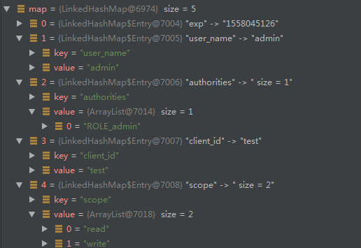
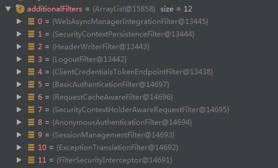
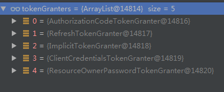

# SpringSecurity Auth2

## 需要增加的依赖

```xml
<dependency>
    <groupId>org.springframework.boot</groupId>
    <artifactId>spring-boot-starter-web</artifactId>
</dependency>
<dependency>
    <groupId>org.springframework.boot</groupId>
    <artifactId>spring-boot-starter-security</artifactId>
</dependency>
<dependency>
    <groupId>org.springframework.security.oauth.boot</groupId>
    <artifactId>spring-security-oauth2-autoconfigure</artifactId>
    <version>2.1.4.RELEASE</version>
</dependency>
```

pom.xml中至少要有以上的依赖

由于SpringSecurity OAuth2是基于SpringSecurity 的所以要引入SpringSecurity的依赖


## OAuth2 Server 配置（单节点）

由于OAuth2 基于Spring Security 所以要有Spring Security 的配置类，

OAuth Server需要继承 **AuthorizationServerConfigurerAdapter**

为了演示需要配置ResourceServer 继承**ResourceServerConfigurerAdapter**

所在这里一共需要三个配置类：

- **AuthorizationServerConfig**:认证服务器配置类

- **ResourceServerConfig**：资源服务器配置类

- **SecurityConfig**：权限配置类

  ### AuthorizationServerConfig配置类

  ```java
  @Configuration
  @EnableAuthorizationServer //加此注解来开启授权服务
  public class AuthorizationServerConfig extends AuthorizationServerConfigurerAdapter {
      @Autowired
      private AuthenticationManager authenticationManager;
      @Autowired
      private UserDetailsService userDetailsService;
      @Override
      public void configure(ClientDetailsServiceConfigurer clients) throws Exception     {
           clients.inMemory() //配置客户端信息为了演示这里配置到了内在中，实际应该保存到数据库
                   .withClient("test") //客户端ID（用来唯一区分一个客户端）
                   .scopes("read","write")//作用域
                   .authorizedGrantTypes("password","refresh_token")//认证类型
                    //客户端的secret 相当于密码（注意这里的{bcrypt}必须加，
                    //且要和加密器的key匹配）
                   .secret("{bcrypt}"+new BCryptPasswordEncoder().encode("222222"))
           ;
  
      }
      @Override
      public void configure(AuthorizationServerEndpointsConfigurer endpoints) {
          endpoints
                  //这里配置Token的存储门面通过该类进行Token的存取
                  .tokenStore(tokenStore()) 
                  //加载定义的用户信息（用户验证时使用）
                  .userDetailsService(userDetailsService)
                  //用户认证管理器（用户验证时使用）
                  .authenticationManager(authenticationManager)
                  //定制异常信息转换
                  .exceptionTranslator(new ExceptionTranslator());;
      }
      @Override
      public void configure(AuthorizationServerSecurityConfigurer oauthServer) {
          oauthServer
                   //允许/oauth/token 以client_id和client_secret作登录认证
                   //可以将client_id和client_secret放到URL或者FORM中
                  //本质是向Filter链中加入ClientCredentialsTokenEndpointFilter
                  .allowFormAuthenticationForClients()
                  //开启/oauth/token_key验证端口无权限访问
                  //取值 permitAll()-允许所有的访问，isAuthenticated()-必须通过认证
                  //denyAll()-不允许访问（默认值）
                  .checkTokenAccess("isAuthenticated()");
      }
      //创建内存管理Token的类
      @Bean
      public TokenStore tokenStore(){
          return new InMemoryTokenStore();
      }
  }
  ```

### ResourceServerConfig 配置类

```java
@EnableResourceServer //开启资源服务
@Configuration
public class ResourceServerConfig extends ResourceServerConfigurerAdapter {
    @Override
    public void configure(HttpSecurity http) throws Exception {
        http.csrf().disable() //禁用 CSRF
                .authorizeRequests()
                .antMatchers("/valid/**","/auth/**")//这些信息也可以配置到数据库中
                .hasRole("admin") //定义只有admin角色才能访问以上资源
        ;
    }
}
```

### SecurityConfig配置类

```java
@Configuration
public class SecurityConfig extends WebSecurityConfigurerAdapter {

    @Autowired
    private PasswordEncoder passwordEncoder;

    @Bean //配置密码加密器
    public PasswordEncoder passwordEncoder(){
        return PasswordEncoderFactories.createDelegatingPasswordEncoder();
    }
    @Override //将用户加载类和加密器配置到Security
    protected void configure(AuthenticationManagerBuilder auth) throws Exception {
        auth
                .inMemoryAuthentication()
                .passwordEncoder(passwordEncoder)
                .withUser("admin")
                .password(passwordEncoder.encode("123456"))
                .roles("admin")
                ;
    }

    @Override
    public void configure(HttpSecurity httpSecurity) throws Exception {
        httpSecurity
                .csrf()
                .disable() //禁用CSRF
                .authorizeRequests()
                .anyRequest()
                .authenticated() //所有的接口都需要认证才能访问
        ;
    }

}

```

## AuthServer 和 ResourceServer分离的配置

AuthServer和ResourceServer不在一个应用时AuthServer端的配置不变，ResourceServer的配置需要做一下调整

### ResourceServer配置 

```yaml
security:
  oauth2:
    resource:
      #配置AuthServer的Token验证接口
      token-info-uri: http://localhost:8081/oauth/check_token 
    client:
      #配置该客户端的id和secret（以此为凭证进行和AuthServer通信）
      client-id: client
      client-secret: secret
```

*注意：需要注意的是在ResourceServer中必须配置client-id和client-secret 否则无法与AuthServer通信，且AuthServer的checkTokenAccess要配置成permitAll()或者isAuthenticated()（由于默认值denyAll() 不允许访问，在使用中一直报403，官方文档中并没有说明此项在配置）*

**RemoteTokenServices**：负责从认证服务器获取用户信息




## 几个主要的类

- **TokenEndpoint** 提供获取和管理Token的接口
- **TokenKeyEndpoint** 检查Token是否有效
- **FilterChainProxy** 过虑链持有类里面管理了所有的过虑器
- **ClientCredentialsTokenEndpointFilter** 判断请求是否需要进行Auth2鉴权处理（判断据 参数中包含client_id、client_secret参数且URI以/oauth/token 结尾）（这是一个过虑器，同时Spring还配置了以下的Filter）
- **ClientDetailsService** 获取配置好的Client的服务类
- **AuthorizationServerEndpointsConfigurer** 在生成Token时进行用户验证
- **CompositeTokenGranter** 里面管理了各种生成Token的分发器根据不同类型来进行分发Token



## 处理过程分析

当访问接口获取Token时都发生了什么？

http://localhost:8081/oauth/token?username=alnezhai&password=123456&grant_type=password&client_id=test&client_secret=123456

### 验证客户端的合法性

客户端的验证是通过client_id和client_secret进行的（相当于用户名和密码，在Spring OAuth中也是这么实现的），这里步是在Spring配置的过虑链中完成的其中两个Filter 分别从不能的位置获取client_id和client_secret

- **ClientCredentialsTokenEndpointFilter** 从URL中获取client_id和client_secret 并进行验证

- **BasicAuthenticationFilter** 从请求头中的Authorization获取client_id和client_secret（获取到的是Base64加密的，格式为 client_id:client_secret）

  以上两个类中都使用了 **ProviderManager** 来对客户端的合法性进行验证，ProviderManager 中管理了多个Provider来进行合法性验证，如果修改认证方式可以通过修改ProviderManager 中的Provider来实现（由于获取到的信息被包装成了**UsernamePasswordAuthenticationToken**类型所在自己实现的Provider需要对该类支持），这里使用的是**DaoAuthenticationProvider** 来验证客户端的合法性。

  **DaoAuthenticationProvider** 中使用的主要的几个类：

  - **ClientDetailsUserDetailsService** 加载已经注册的客户端信息 根据 配置可以从内在或者数据库中加载这些信息（分别使用 **InMemoryClientDetailsService**和**JdbcClientDetailsService**，也可以自己实现<u>ClientDetailsService</u> 接口）
  - **WebSecurityConfigurerAdapter** 对加载的客户端信息和提供的客户端信息进行对比（以此来验证合法性）

  到此客户端信息的合法性验证完成如果不合法将无法访问http://localhost:8081/oauth/token 接口，如果验证通过则将在/oauth/token 接口中进一步验证用户的合法性进而分配access_token,这里以grant_type=password 的类型进行说明。

  ### 验证用户的合法性

  这里以grant_type=password 为例说明用户合法性的验证以及access_token的分配

  /oauth/token 的处理类为 org.springframework.security.oauth2.provider.endpoint.TokenEndpoint这个类在spring-security-oauth2-xxx.jar中

  ```java
  @RequestMapping(value = "/oauth/token", method=RequestMethod.POST)
  public ResponseEntity<OAuth2AccessToken> postAccessToken(
      			Principal principal, 
      			@RequestParam Map<String, String> parameters) 
      			throws HttpRequestMethodNotSupportedException {
  
  		if (!(principal instanceof Authentication)) {
  			throw new InsufficientAuthenticationException(
  					"There is no client authentication. Try adding an appropriate authentication filter.");
  		}
          //获取client 信息
  		String clientId = getClientId(principal);
  		ClientDetails authenticatedClient = getClientDetailsService().loadClientByClientId(clientId);
         //构造生成Token的请求
  		TokenRequest tokenRequest = getOAuth2RequestFactory().createTokenRequest(parameters, authenticatedClient);
          //判断客户端信息和请求的客户端信息是否一致
  		if (clientId != null && !clientId.equals("")) {
  			// Only validate the client details if a client authenticated during this
  			// request.
  			if (!clientId.equals(tokenRequest.getClientId())) {
  				// double check to make sure that the client ID in the token request is the same as that in the
  				// authenticated client
  				throw new InvalidClientException("Given client ID does not match authenticated client");
  			}
  		}
          //判断Scope是否合法
  		if (authenticatedClient != null) {
  			oAuth2RequestValidator.validateScope(tokenRequest, authenticatedClient);
  		}
  		if (!StringUtils.hasText(tokenRequest.getGrantType())) {
  			throw new InvalidRequestException("Missing grant type");
  		}
  		if (tokenRequest.getGrantType().equals("implicit")) {
  			throw new InvalidGrantException("Implicit grant type not supported from token endpoint");
  		}
          //根据grant_type 来进行处理
  		if (isAuthCodeRequest(parameters)) {
  			// The scope was requested or determined during the authorization step
  			if (!tokenRequest.getScope().isEmpty()) {
  				logger.debug("Clearing scope of incoming token request");
  				tokenRequest.setScope(Collections.<String> emptySet());
  			}
  		}
  
  		if (isRefreshTokenRequest(parameters)) {
  			// A refresh token has its own default scopes, so we should ignore any added by the factory here.
  			tokenRequest.setScope(OAuth2Utils.parseParameterList(parameters.get(OAuth2Utils.SCOPE)));
  		}
          //加载Token分配器
  		OAuth2AccessToken token = getTokenGranter().grant(tokenRequest.getGrantType(), tokenRequest);
  		if (token == null) {
  			throw new UnsupportedGrantTypeException("Unsupported grant type: " + tokenRequest.getGrantType());
  		}
  
  		return getResponse(token);
  
  	}
  ```

  在加载Token分配器的时候 getTokenGranter() 获取到的类为 **AuthorizationServerEndpointsConfigurer**

  在这个类中有一个CompositeTokenGranter 类里面集合了处理所有grant_type的Token分配器

  

  这里的grant_type=password 用到的为 **ResourceOwnerPasswordTokenGranter**在该类中对用户名和密码进行了验证

  ```java
  @Override
  protected OAuth2Authentication getOAuth2Authentication(
      ClientDetails client, TokenRequest tokenRequest) {
  
  		Map<String, String> parameters = new LinkedHashMap<String, String>(tokenRequest.getRequestParameters());
  		String username = parameters.get("username");
  		String password = parameters.get("password");
  		// Protect from downstream leaks of password
  		parameters.remove("password");
          //构造用户验证的包装类
  		Authentication userAuth = new UsernamePasswordAuthenticationToken(username, password);
  		((AbstractAuthenticationToken) userAuth).setDetails(parameters);
  		try {
              //进行用户合法验证
  			userAuth = authenticationManager.authenticate(userAuth);
  		}
  ```

  这里相当于进行了两级的验证 
    1、第一级 进行Cleint和Secret的验证
    2、第二级 根据grant_type 进行用户名的验证
  注意：在第一级验证的时候 Secret的前面需要加**{加密类型}secret的值**（secret被认为是密码，在Spring5中密码前必须加加密类型且包含在大括号中如果不加密则加{noop}）

